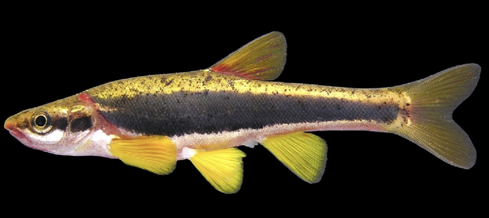

```{r packages, message=FALSE, warning=FALSE, include=FALSE}
knitr::opts_chunk$packages
library(tidyverse)  #importing, tidying, plotting data
library(knitr)      #making tables
library(leaflet)
library(tinytex)   #may need for knitting pdf versions of .rmd file
library(hexbin) 
library(ggplot2)
```

Visualizing mtcars data.]{style="color:red"}

```{r mtcarsplot_mph_hp}
plot(mpg ~ hp, data = mtcars)
model_1 <- lm(mpg ~ hp, data = mtcars)
abline(model_1)

```

```{r mtcarsplot_mph_cyl}
plot(mpg ~ cyl, data = mtcars)
model_1 <- lm(mpg ~ cyl, data = mtcars)
abline(model_1)

```

[Model of MPG and HP.]{style="color:red"}

```{r mtcars_model_mpg_hp}
model_2 <- lm(mpg ~ hp, data = mtcars)
anova(model_2)
```

[Model of MPG and CYL.]{style="color:red"}

```{r mtcars_model_mpg_cyl}
model_2 <- lm(mpg ~ cyl, data = mtcars)
anova(model_2)
```

[Plot of MPG and HP .]{style="color:red"}

```{r mtcars MPG vs HP Graph, echo=FALSE, message=FALSE, warning=FALSE}
ggplot(mtcars, aes(mpg, hp)) +
geom_line()

ggsave("images/mtcars_mpg,hp.png")
```

[Plot of MPG and CYL .]{style="color:red"}

```{r mtcars MPG vs CYL Graph, echo=FALSE, message=FALSE, warning=FALSE}
ggplot(mtcars, aes(mpg, cyl)) +
geom_point()

ggsave("images/mtcars_mpg,cyl.png")
```

```{r kable_mtcars_first20}
kable(mtcars[1:20, ], caption = 'Table 1. A knitr kable displaying the first 20 cars in the data set.')
```

```{r kable_mtcars_last_cars}
kable(mtcars[22:31, ], caption = 'Table 1. A knitr kable displaying the last cars in the data set.')
```

[Stream with Blackside Dace (*Chrosomous cumberlandensis*)]{style="color:red"}

 Note to myself on how to add pictures. <https://www.earthdatascience.org/courses/earth-analytics/document-your-science/add-images-to-rmarkdown-report/>

```{r Map, echo=FALSE}
leaflet() %>%
  setView(-84.388752, 36.978237, zoom = 16) %>% #lat-long of the place of interest
  addTiles() %>%
  addMarkers(-84.388752, 36.978237, popup = "Big Lick Branch")
```

```{r setup, include=FALSE}
knitr::opts_chunk$set(echo = TRUE)
```
